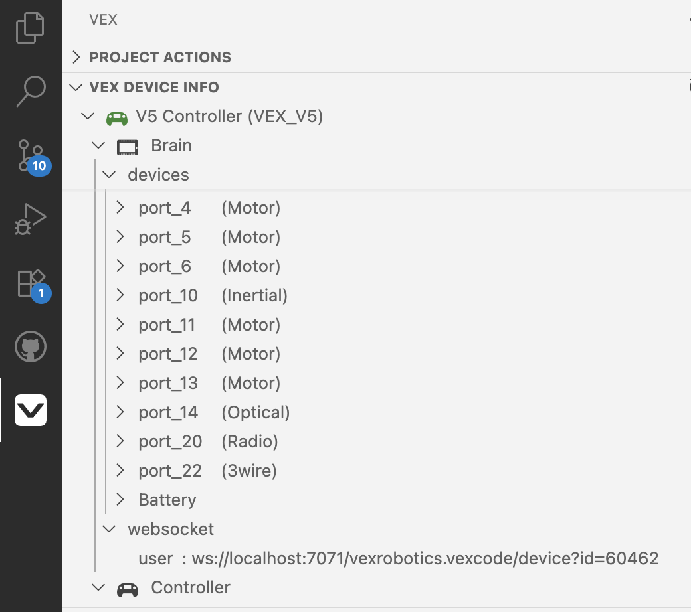

# How to Find Your VEX Robot Device ID

## Overview

This guide explains how to enable WebSocket communication and find your robot's Device ID for the Command Line Interface.

## Prerequisites

Before you can connect to your robot, you need:

- VEX V5 Brain connected to your computer via USB
- VEX VS Code Extension installed
- Your robot program uploaded to the V5 Brain

## Step 1: Enable WebSocket Server in VS Code

- Click on the Setting Icon at the bottom left of the VS Code User Interface and select "Settings"
- Type "vex" in the search box. Scroll down to vexrobotics.vexcode.WebsocketServer
- Select **Enable**. Set host address to localhost and port to 7071.

## Step 2: Find Your Device ID
- In VS Code, click on the VEX icon in the left bar of the VS Code User Interface.
- Expand the VEX Device Info view.
- Look for the 5 digit **id** at the end of the url.

*Example: ID shown in WebSocket entry*

## Troubleshooting

### WebSocket Server Not Starting
- Make sure your V5 Brain is connected via USB
- Ensure your robot program is uploaded to the brain
- Try restarting VS Code
- Check that the VEX VS Code Extension is properly installed

### Connection Failed
- Double-check the Device ID is correct
- Ensure the WebSocket server is enabled
- Try refreshing web page

## Important Notes

**Important:**  The Device ID is unique to your VSCode session and will remain the same unless you restart VS Code.
