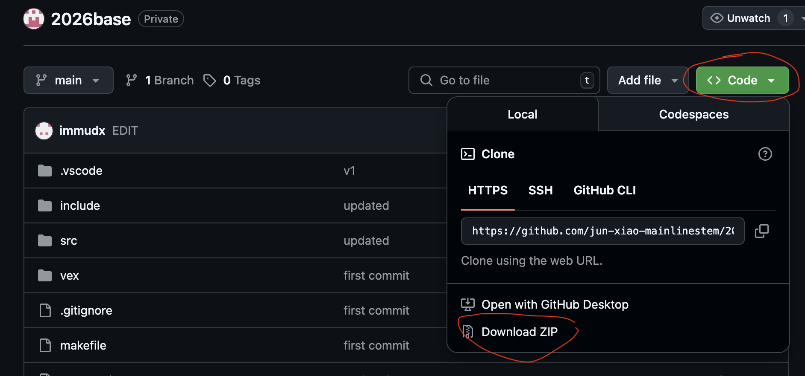

RGB BOTS TEMPLATE IS INSPIRED BY JARS-TEMPLATE

# Install
## Download the source code
go to [github](https://github.com/jun-xiao-mainlinestem/2026base), download the source code as zip file.



## Open the project in VS code
- unzip the downloaded file to a folder on local drive
- in vscdoe, select menu 'file' -> 'open folder' 

# Edit the code
## chassis.cpp
modify motor and inertia sensor port number

## robot-config.cpp
add more motors and sensors and functions for other systems such as intake

## autons.cpp
write your own auton functions with drivetrain (chassis) APIs:
```cpp
chassis.turn_to_heading(90);
chassis.drive_distance(24);
chassis.drive_with_voltage(6, 6);
```
## main.cpp
write additional functions for game plays and change the gamepad controls (buttons).